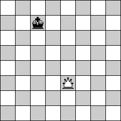

# The Queen threatens the King



Given an imaginary chess board of size _m_ x _n_ including only the Queen and the King write a function that takes the positions (coordinates) of both the Queen and the King as parameters and returns a boolean telling whether or not the King is threatened by the Queen:

```js
function threatens(qX, qY, kX, kY) {
  // ...
}
```

Extra: how would you modify your solution if the rest of the chessmen were included in the board?

If you are not familiar with the rules of chess, please refer to the [related Wikipedia page](http://en.wikipedia.org/wiki/Queen_(chess)) to learn how the Queen can move around the chess board and threaten other chessmen.
