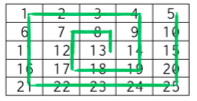
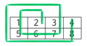

# Spiral

Write a function that accepts four arguments. The first two arguments are the size of the grid (*h x w*), filled with ascending integers from left to right, top to bottom, starting from 1. The next two arguments are the starting positions, the row (*r*) and column (*c*).

Return an array of integers obtained by spiralling outward anti-clockwise from the *r* and *c*, starting upward.

```
f(5, 5, 3, 3) // [ 13, 8, 7, 12, 17, 18, 19, 14, 9, 4, 3, 2, 1, 6, 11, 16, 21, 22, 23, 24, 25, 20, 15, 10, 5 ]

f(2, 4, 1, 2) // [ 2, 1, 5, 6, 7, 3, 8, 4 ]
```

**Supporting Content**

The following graphics show the grid in question and the spiral generated, beginning at cell (3, 3).




