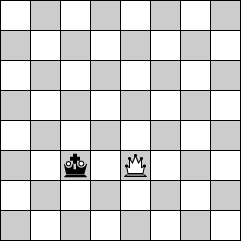

Visualizing the different ways the Queen and the King can be located relative to each other should help solve the problem. As the Queen can only move horizontally, vertically or diagonally (45°) it should be easy to deduce that the King is always threatened by the Queen if they are located in the same row (horizontally aligned) or column (vertically aligned):

The somewhat less trivial case is to check if the Queen and the King are in the same diagonal. The problem can be however greatly simplified by only focusing on the part of the board that is covered by the rectangle given by the Queen's and the King's coordinates:

From here it should become obvious that the Queen and the King will be located on the same diagonal only if the rectangle they form is a square, i.e. &#916;x == &#916;y:

