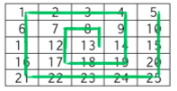

# Spiral

*Solutions will be evaluated based on correctness, clarity, efficiency and best practices.*

*You should use keyboard input and console output in all cases but parameter passing to functions are also acceptable. The input and output cases shown are for testing purposes only, and are not an accurate representation of the test data.*

You are given the dimension of a *h x w* grid filled with consecutive integers from left to right, top to bottom, starting with 1.

You are also given a starting position *r c*. The output should be the ordered list of integers obtained by spiralling outward in an anti-clockwise direction from row *r* column *c*, starting upward.

**Input 1**

```
5 5 3 3
```

**Output 1**

```
13 8 7 12 17 18 19 14 9 4 3 2 1 6 11 16 21 22 23 24 25 20 15 10 5
```

**Explanation 1**

The following graphics show the grid in question and the spiral generated, beginning at cell (3,3).



**Input 2**

```
2 4 1 2
```

**Output 2**

```
2 1 5 6 7 3 8 4
```

**Explanation 2**


## Solution

```
cat input-1.txt | node index.js
cat input-2.txt | node index.js
```
